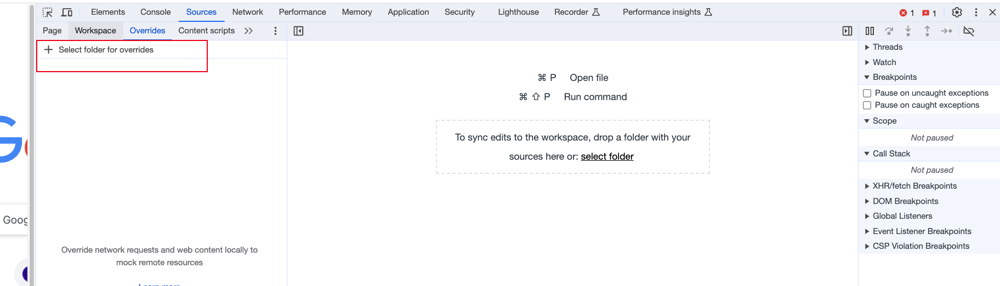
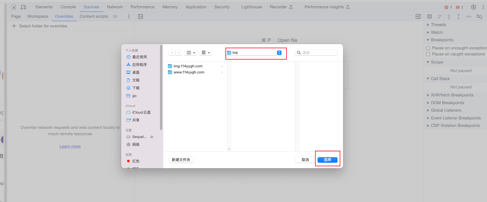
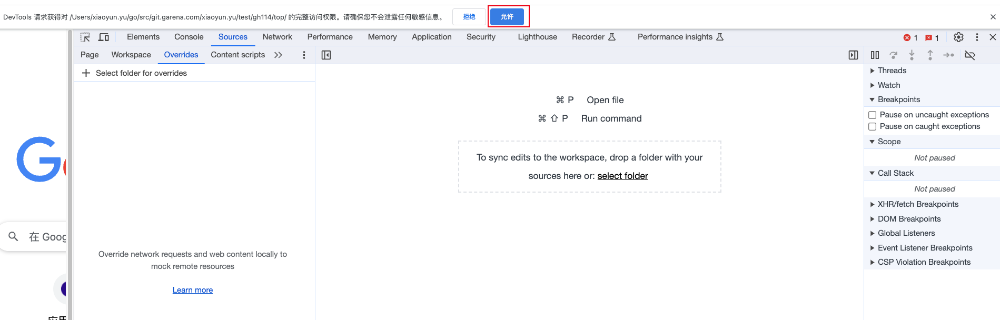
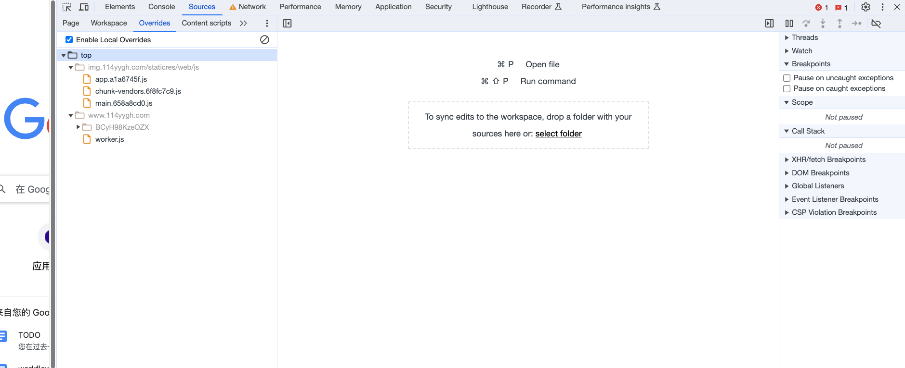
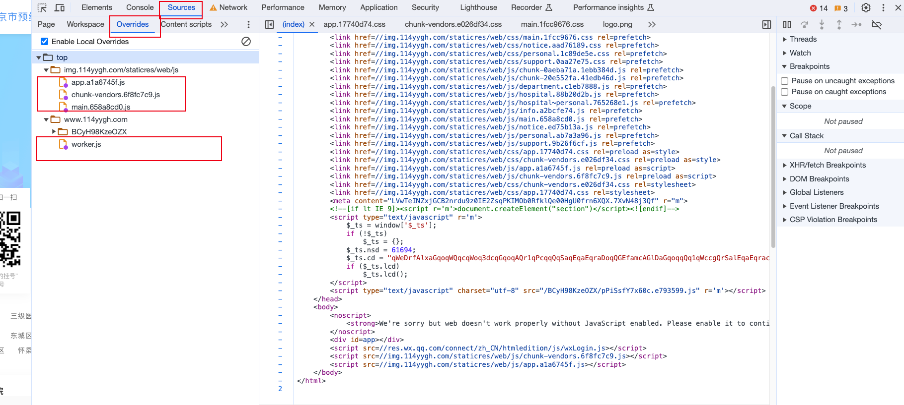

# 1.26 更新

114升级了安全系统, 只能通过微信公众号/小程序进行挂号, 且深度接入了微信的鉴权系统, 已经很难通过后端脚本挂号. 未来只能通过手机按键精灵等前端模拟方式抢号...

==========================================
# 使用说明

## 前置

1. 需要一台 mac 电脑
2. 通过 homebrew 预安装 make
3. 安装 chrome 浏览器
4. 预先将此文件夹下的 ./top 文件夹设置到 chrome 浏览器开发者工具的 overrides 中:




## 抢号流程
1. 在 config 目录下创建 config.yaml 配置文件, 将 config_template.yaml 文件中的内容 copy 到 config.yaml
2. 根据注释修改 config.yaml 文件
3. 在抢号当日快开始的时候(比如提前 10 分钟, 不能太早, 否则登录会过期), 在命令行执行命令:
   ```
   make exec 
   ```
4. 打开 chrome 浏览器, 打开开发者工具, 登录网站 https://www.114yygh.com/, 点击 Sources->Overrides, 展开 top下所有文件夹, 看到下图中所有文件图标右下角出现紫色小圆点, 代表这些文件已经成功覆盖 114 网站源文件:



6. 回到命令行终端, 等待一会儿会弹出验证码图片, 读到图片后, 将图片中的数字输入到命令行
7. 再等待一会儿会向你手机发送验证码, 读到验证码后, 将数字输入到命令行
8. 至此登录成功, 脚本会在预定时间进行抢号
9. 抢号成功后, 会在命令行打印成功的消息, 看到以下信息说明抢号成功
    - "successfully get order......"
10. 有些医院抢到号之后需要支付挂号费, 需要到具体的医院公众号上查看是否需要支付. 

# TODO
- [x] client.getDetails 检查是否所有医生都没号 
- [x] 支持忽略判断医生是否有号, 直接抢号
- [ ] 支持按级别排序, 支持自定义优先级
- [ ] 起协程不断刷新医生剩余号, 没有剩余号立即结束
- [ ] 如果重试有限流, 添加退让机制
- [ ] 支持捡漏